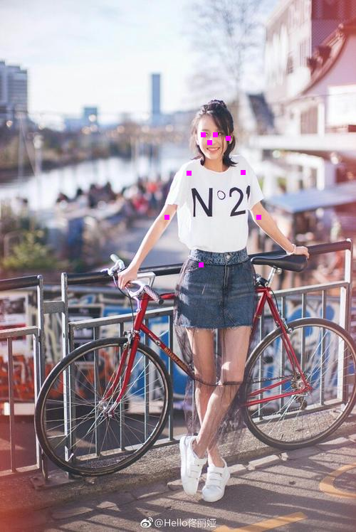

- 编译运行第一个demo

  - 下载源码

    ```shell
    git clone https://github.com/alibaba/MNN.git MNN
    ```

  - 编译模型转换工具和demo文件

    ```shell
    cd MNN
    mkdir build && cd build
    cmake -DMNN_BUILD_CONVERTER=true -DMNN_BUILD_DEMO=ON ..
    make -j2
    ```

    如果执行cmake时报错“Could NOT find Protobuf (missing: Protobuf_LIBRARIES Protobuf_INCLUDE_DIR)”时，首先确认一下是否已经安装了protobuf，如果未安装则需要先安装一下protobuf。

    对于mac来说，可以按照下面方式安装protobuf。

    ```shell
    brew install protobuf
    ```

    编译完成后，在build目录下应该生成MNNConvert模型转换工具，以及pictureRecognition.out、pictureRotate.out、multiPose.out、segment.out和expressDemo.out这5个demo的可执行文件。

  - 运行一个demo

    这里我尝试跑multiPose.out这个demo。从[这里](https://raw.githubusercontent.com/czy2014hust/posenet-python/master/models/model-mobilenet_v1_075.pb)下载multiPose的模型，使用MNN提供的模型转换工具将下载的tensorflow模型转换成MNN格式的模型。执行下面的命令完成模型转换：

    ```shell
    ./MNNConvert --framework TF --modelFile ./model-mobilenet_v1_075.pb --MNNModel multipose.mnn --bizCode MNN
    ```

    当看到打印出"Converted Done!"时，模型应该已经正确转换完成了，在当前目录下已经生成了转换后的模型multipose.mnn。

    准备一张jpg格式的测试图片[test.jpg](./test.jpg)，执行下面命令进行预测：

    ```shell
    ./multiPose.out ./multipose.mnn test.jpg pose2.jpg
    ```

    结果示例：

    

